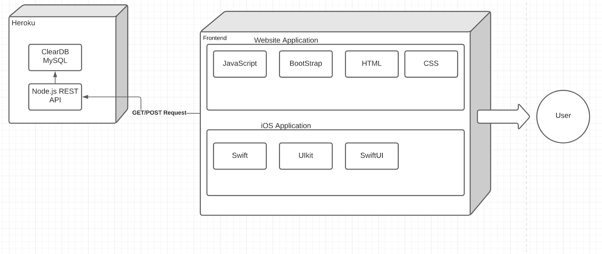

## Introduction
Students struggle to create schedules. Course Planner is the solution. Through a website or an app, Course Planner allows you to login to your unique account, view a list of your major’s requirements, and create a schedule fit to you. Course Planner- Create your own path.
## Installation
In order to install this project navigate to our repository found in the Contact section below. Next, clone the repo on your local computer. To access the web side of our software locate courseSite.html and open it with your web browser. To access the app use xcode and navigate within the iOS folder and launch the project.
## Software Architecture
### iOS App  
Swift using XCode  
### Website: 
JavaScript, HTML CSS, and Bootstrap using VSCode  
### Database: 
MySQL and Node.js Express REST API  
### Misc.
gitHub, Sourcetree, and Heroku  

## Metrics
### Velocity
12 user stories per sprint
### Number of Defects by Severity per iOS Sprint
Number of new and existing defects by severity per iOS sprint where towards the beginning we had no bugs but towards the end bugs became evident because of the attempts to implement functionality into the app. In general we did okay handling defects that never impede our progress in our sprints. Whether these defects have been solved or not our team has been able to navigate around the defects strategically to continue on making progress towards our goals in Course Scheduling.  
### Cyclomatic Complexity
For javaScript on the web application we caluclated it to be ...
## Retrospective
Overall our team did the best we could with the limited experience and time we had for this class project. Some things that went well was the management side of the team that kept our team focused on the tasks that required attention, which new tasks to tackle, and any concerns needed to be addressed. We've also been able to complete sprints on time which was an overall new experience using an agile format for this project. Some things that we could have done better was trying to assign more user stories to the sprints despite the lack of experience, time, and resources. Some things that have left us puzzeled after this class was the unfamiliar programming languages that we had little experience in. After this class, we'd like to come back to some of these concepts and mistakes and find new opportunities to improve in these areas. 

### Support or Contact

Having trouble with Pages? Check out our [documentation](https://docs.github.com/categories/github-pages-basics/) or [contact support](https://github.com/contact) and we’ll help you sort it out.
