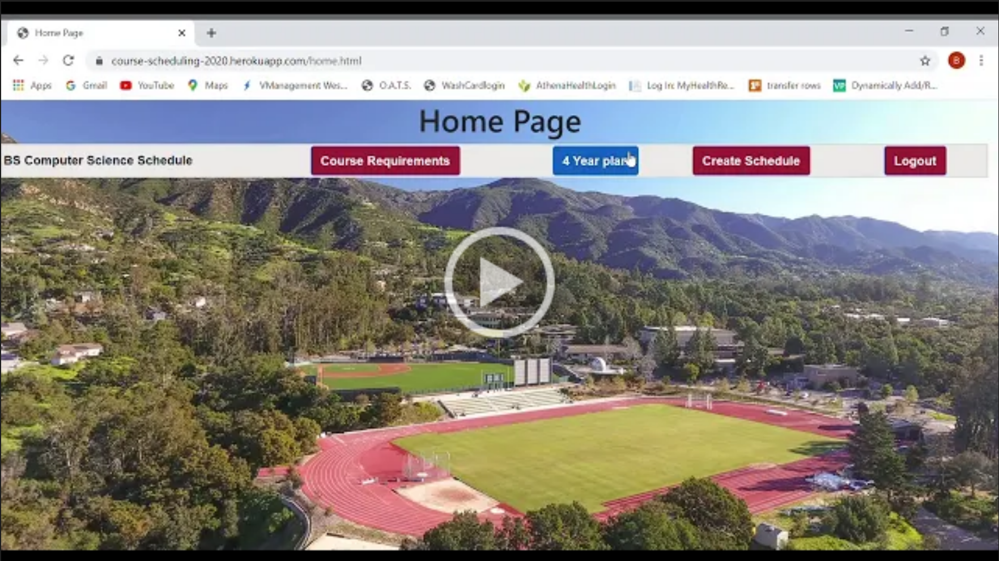
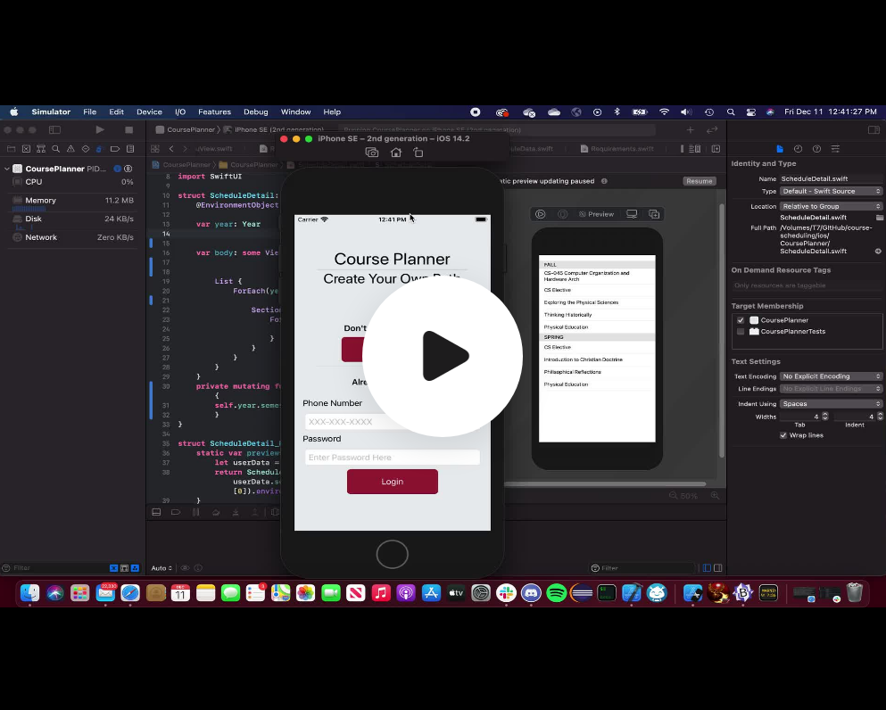
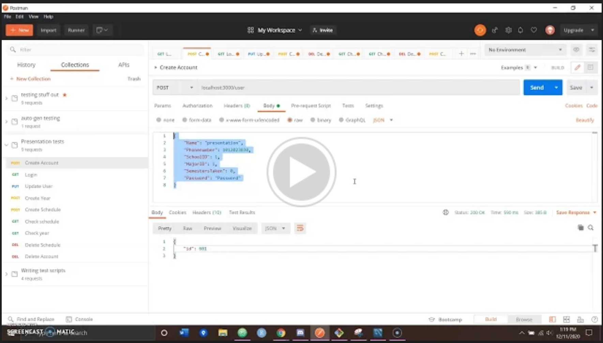
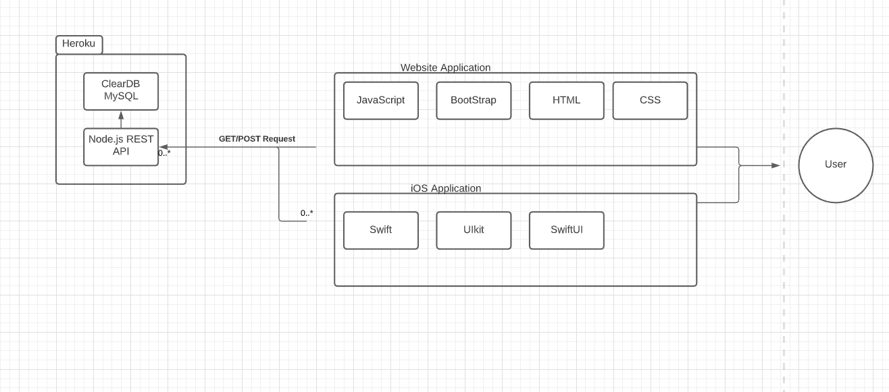
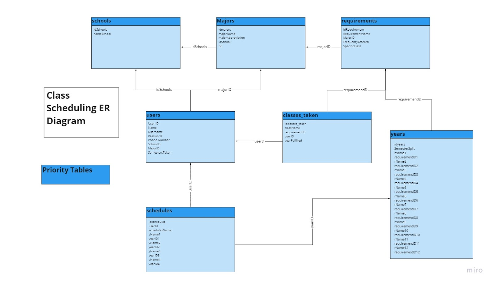
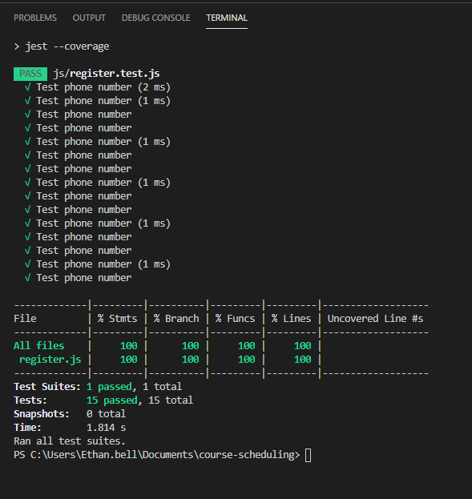

## Introduction
Students struggle to create schedules. Course Planner is the solution. Through a website or an app, Course Planner allows you to login to your unique account, view a list of your major’s requirements, and create a schedule fit to you. Course Planner- Create your own path.
## Installation
In order to install this project navigate to our repository by navigating to the "Fork Me On GitHub" link. Next, clone the repo on your local computer. To access the web side of our software locate courseSite.html and open it with your web browser or you can access it [here](https://course-scheduling-2020.herokuapp.com/courseSite.html). To access the app use xcode and navigate within the iOS folder and launch the project. To get the API set up you need to first go and clone the [repo](https://github.com/samun101/mysql-api) on github, and then you need to set up a database as described by the ERDocument.  Then you can set up a place to host the server and database (we utilized Heroku and ClearDB mysql on heroku, and as such have the procfile ready), once you do this you need to edit the database.js file, where it creates the connection to the database, to reflect the config variables for your current database.  Then you would need to reroute the http calls in the IOS and WebApp portion to the new location that the database and API are being hosted.  After this you are ready to begin building the database from the empty.
## Video Demos
### Web App

### iOS App

### Backend

## Software Architecture

### iOS App  
Swift using XCode  
### Website 
JavaScript, HTML CSS, and Bootstrap using VSCode  
### Database 
MySQL and Node.js Express REST API  
### Misc.
gitHub, Sourcetree, and Heroku  

## Metrics
### Analysis
From our metric analysis we learned that we completed on average 12 user stories per sprint, the CCN for our code was very low, bugs were few in the beginning, but they presented themselves in the program as we added functionality, which is expected, and for the most part we didn’t take too many shortcuts that lead to more work for ourselves further into the semester.  

Our time  estimations for user stories were, however, way off by an average of 377%!

### Velocity
12 user stories per sprint
### Number of Defects by Severity per iOS Sprint
Number of new and existing defects by severity per iOS sprint where towards the beginning we had no bugs but towards the end bugs became evident because of the attempts to implement functionality into the app. In general we did okay handling defects that never impede our progress in our sprints. Whether these defects have been solved or not our team has been able to navigate around the defects strategically to continue on making progress towards our goals in Course Scheduling.  
### Cyclomatic Complexity
For javaScript on the web application and iOS on the mobile appication.
### Technical Debt
Calculated Technical Debt for the web application.
### Test Coverage
Calculated the total test coverage for the web application.  

### Estimation Accuracy 
Estimated the accuracy of our code among the codebase.
### Technical Debt
Calculated the technical debt of our backend. 
## Retrospective
Overall our team did the best we could with the limited experience and time we had for this class project. Some things that went well was the management side of the team that kept our team focused on the tasks that required attention, which new tasks to tackle, and any concerns needed to be addressed. We've also been able to complete sprints on time which was an overall new experience using an agile format for this project. Some things that we could have done better was trying to assign more user stories to the sprints despite the lack of experience, time, and resources. Some things that have left us puzzeled after this class was the unfamiliar programming languages that we had little experience in. After this class, we'd like to come back to some of these concepts and mistakes and find new opportunities to improve in these areas. 
## Licensing
We have decided to go with the MIT license. We chose this particular license as it is open for changing even the source code. Which we thought was best because of our lack of experience. The MIT license would potentially allow a more experienced developer to fix our mistakes and create a more polished all around product.
